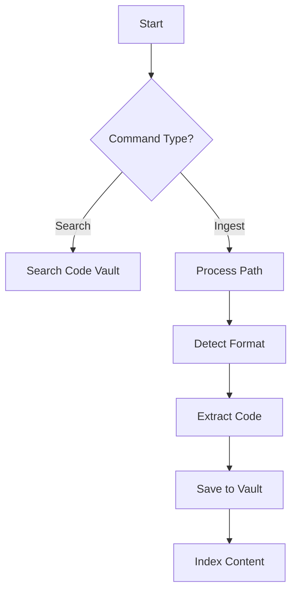

# Code Search & Ingestion

## Commands
```bash
pi search code [query]
pi ingest code [path]  # for manual ingestion
```

## Use Cases
1. Find code examples
   ```bash
   > pi search code "asyncio websocket"
   Found examples:
   1. ~/work/archive/2023/websocket_examples/client.py
   2. ~/work/projects/chat/telegram_bot/ws_handler.py
   ```

2. Auto-ingestion of old formats
   ```bash
   > pi ingest code ~/old_stuff/jupyter
   Processing notebooks...
   - chat_examples.ipynb -> ~/work/code_vault/2023/chat/examples/
   - websocket_test.ipynb -> ~/work/code_vault/2023/network/websocket/
   ```

## Special Cases
- Jupyter notebooks (.ipynb)
- Markdown with code blocks
- Old project drafts
- Random .py files in notes

## Flow Diagram


# Raw
More ideas: 
a) find projects - using regular search
b) code search, code vault
c) find mini-projects
    in dev/draft
    in older formats - notes, jupyter notebooks etc.
d) analyze projects: extract ideas and drafts from project name, contents
    - Bonus: match with Notion, Remnote, Obsidian ideas. 