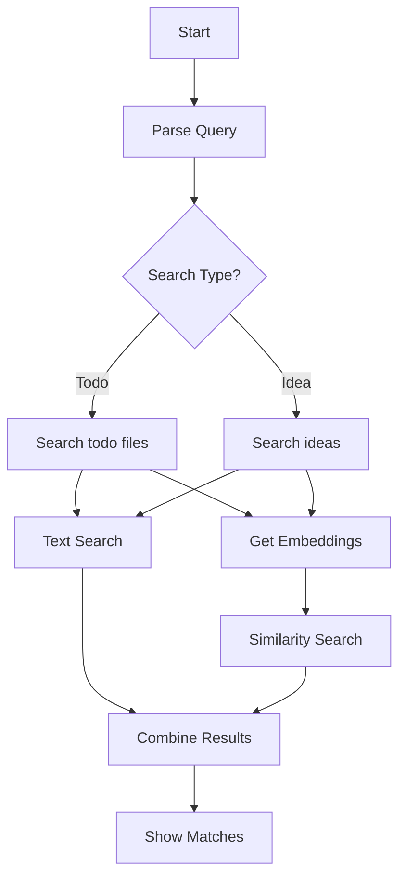

# Todo & Idea Search

## Commands
```bash
pi search todo [query]
pi search idea [query]  # focuses on idea.md files
```

## Use Cases
1. Find related todos
   ```bash
   > pi search todo "websocket client"
   Found todos:
   1. ~/work/projects/chat/dev/todo_2024_01.md:
      - [ ] Add websocket client reconnection
   2. ~/work/archive/2023/websocket/ideas.md:
      - [x] Test websocket client with asyncio
   ```

2. Search ideas from structure
   ```bash
   > pi search idea "chat"
   Found ideas:
   1. ~/work/projects/chat_experiments/  # from folder name
   2. ~/work/drafts/2023/gpt_chat_ideas/idea.md
   3. ~/work/archive/telegram_bot_draft/chat_features.md
   ```

## Special Cases
- Folder names as ideas
- idea.md files
- todo_*.md files
- Random .md files with todo markers
- Future: external sources
  - Notion
  - Obsidian
  - Remnote

## Search Implementation
1. Text-based Search
   - Basic substring matching
   - Regex for todo markers
   - File name pattern matching

2. Semantic Search
   - Vector embeddings database for all content
   - Embed todo text and descriptions
   - Embed folder/file names for idea search
   - Use similarity search for better matches
   ```python
   # Example similarity config
   embeddings:
     model: "text-embedding-3-small"  # OpenAI
     cache_path: "~/.cache/project_inspector/embeddings/"
     batch_size: 100  # for ingestion
   ```

## Flow Diagram Updated


# Raw
search_todo is also important scenario. and specifically search out the ideas in old .md files and just from the tree folder structure (sometimes ideas are in file and folder names

Maaybe in the future i'll also include my old notion / obsidian / remnote notes as well... 