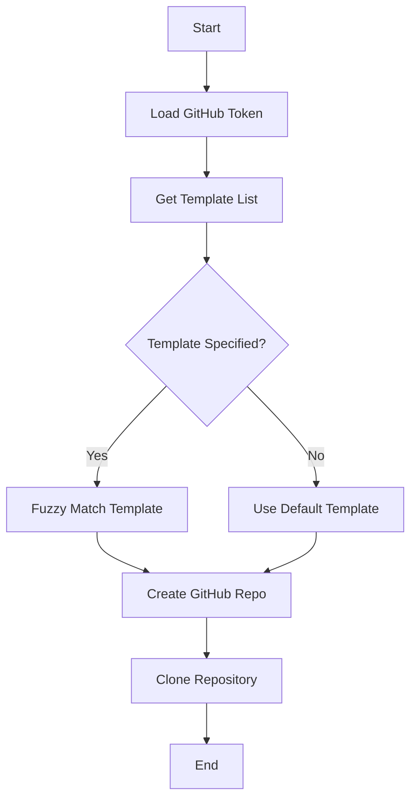

# GitHub Template Integration

## Overview
Handles GitHub template repository operations for new project creation, including authentication, template selection, and repository creation.

## Command Usage
```bash
new_project [name] -t [template] [--private]
```

## Core Features
1. GitHub Authentication
   - Load GitHub token from environment variables
   - Support multiple token variable names (GITHUB_API_TOKEN, API_TOKEN_GITHUB, GITHUB_TOKEN)
   - Load from ~/.env or similar local config

2. Template Management
   - Cache list of available GitHub templates
   - Support template name fuzzy-matching
   - Handle template validation and conflicts

3. Repository Creation
   - Create new repository from template
   - Support private repository flag
   - Handle name conflicts
   - Clone repository locally

## Flow Diagram


## Error Handling
- Missing GitHub token
- Invalid template name
- Repository name conflicts
- Network issues during clone
- Permission issues

## Configuration
Template settings in project config:
```yaml
github:
  default_template: "base-template"
  token_env_vars:
    - GITHUB_API_TOKEN
    - API_TOKEN_GITHUB
    - GITHUB_TOKEN
  cache_timeout: 3600  # seconds
```

# Raw
for template name parsing
here's a scenario from my head
0) need github token?, need to recover it from anywhere - so probably have it at ~/.env or somth. Need to design a good way.
1) get all template names from github
2) use subsequance match (so pyte -> matches python_tempalte) - i have the func in calmlib
3) auto-select template if there's one match only
else print matches and raise
alternatively: let me select from options? 
4) should we allow typos? 
print all templates if no match

I have old implementation at @dev_env.py i think. use it as reference as well
