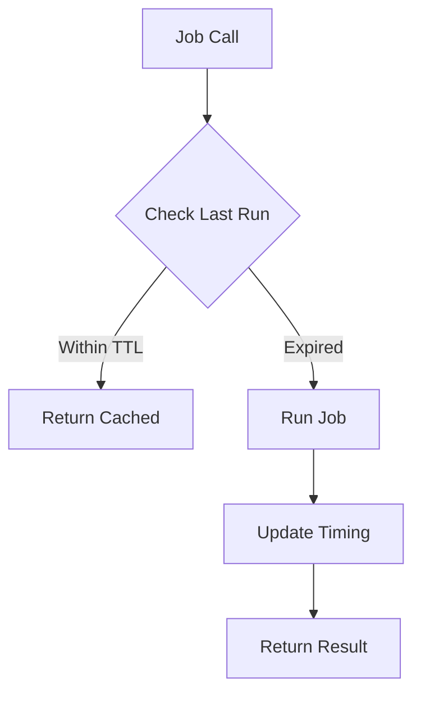

# Job Timing System

## Overview
Simple job timing tracker for caching and sanity checks.

## Core Features
1. Job Run Tracking
   ```python
   @track_job_run("repo_discovery")
   def discover_repos():
       ...

   # Or manually
   with JobTracker("seasonal_check"):
       check_seasonal_folders()
   ```

2. Run Time Storage
   - Location: ~/.calmmage/job_timing/
   - Format: {job_name}.json
   ```json
   {
     "last_run": "2024-03-15T14:30:00",
     "run_count": 42,
     "settings": {
       "ttl_days": 7
     }
   }
   ```

3. Time-based Guards
   ```python
   if not should_run_job("repo_discovery", ttl_days=7):
       return cached_result()
   ```

## Flow Diagram


# Raw
Idea: make a tool that 
1) has a folder at ~/.smth 
2) saves there times when it ran a job 
3) can check and NOT run a job if last run is within (delta)

sanity checks -> in code: call "sanity_check(func, settings)" or something -> track job runs in metadata files and only run if not run within configured timespan
