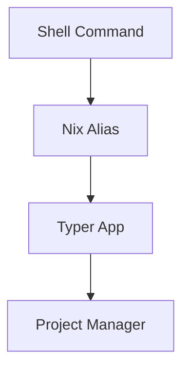

# Nix Command Aliases

## Overview
Shell aliases for project manager commands, implemented via nix and pointing to typer app.

## Core Aliases
```bash
# Main commands
pm='typer app.py run'              # project manager base command
np='typer app.py run new_project'  # new project
nmp='typer app.py run new_mini'    # new mini project
nt='typer app.py run new_todo'     # new todo
nf='typer app.py run new_feature'  # new feature

# Variants with embedded flags
nto='typer app.py run new_todo --open'  # new todo + open in editor
```

## Flow Diagram


# Raw
also
nmp - mini project

maybe some options with flags embedded
 - e.g. 'nto' - new todo --open

aliases will be to a typer -> app.py run command (just so that we are clear)
