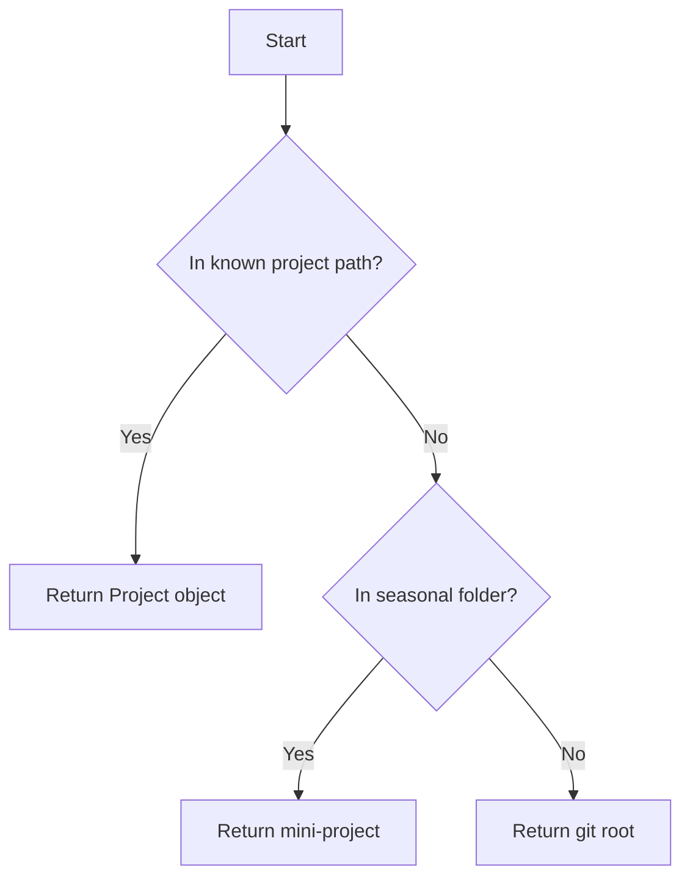

# Project Auto-detection

## Overview
Lightning-fast project detection based on current directory location.

## Core Logic
1. Check if within known project paths:
   - Use shared Project object from lib
   - Return (project_name, root_path) if found

2. Special Case: Mini-projects
   - If within calmmage/calmmage-private seasonal folders
   - Return mini-project instead of git root

3. Fallback: Git Root
   - Get git root of current directory
   - Return (repo_name, root_path)

## Flow Diagram

# Raw
naah.
This should be really simple. 

This should work blazingly fast.
- Detect project by checking if current directory is:
- Inside known project paths
- Inside a git repo
- Return project name and root path (shared Project object from lib)

- special case: mini-projects.
if we're within calmmage/calmmage-private destination - seasonal subfolder - pick a mini-project instead, not git root.