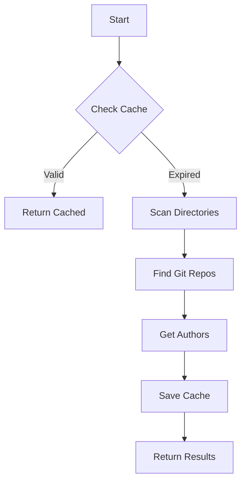

# Project Discovery Cache

## Overview
Cache-aware project discovery system based on git repositories.

## Core Features
1. Repository Discovery
   ```python
   class Settings(BaseSettings):
       projects_root_dirs: List[str] = [".", "~/projects", "~/work"]
       repo_cache_ttl_days: int = 7
       repo_cache_path: Path = Path("~/.calmmage/cache/repo_discovery.json")
   ```

2. Cache Management
   ```json
   {
     "timestamp": "2024-03-15T14:30:00",
     "repos": [
       "~/work/projects/my-project",
       "~/projects/another-repo"
     ],
     "authors": {
       "~/work/projects/my-project": ["calmmage"]
     }
   }
   ```

3. Smart Discovery
   - Uses @track_job_run from job_timing
   - Scans configured root directories
   - Skips .git internals
   - Collects author information

## Flow Diagram


# Raw
- caching -> that's about @repo_discovery.py caching. Found repos.
