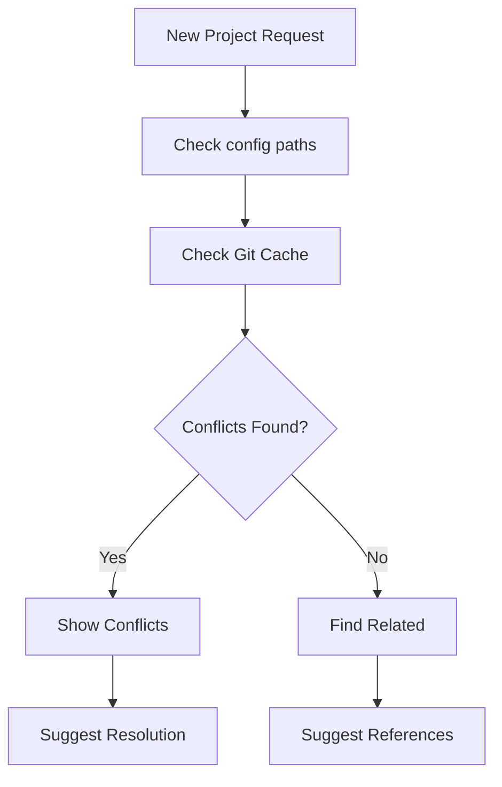

# Project Search

## Overview
Quick conflict detection and context suggestion during project creation.

## Core Features
1. Conflict Detection
   - Check against paths in config.yaml
   - Basic cached git repo detection
   - Return potential conflicts before creation

2. Context Suggestion
   - Find related past projects
   - Suggest as references during creation
   - Option to include refs in new project

## Configuration
```yaml
project_manager:
  legacy_paths:
    - ~/work/old_projects
    - ~/work/archived
  cache_file: ~/.cache/project_manager/projects.json
```

## Flow Diagram


# Raw
2) here, in the context of project manager the goal is twofold:
- for new project and miniproject creation - avoid duplicates or include references to old projects - for useful context
- for todos and features - discover to which project to add them (/suggest) quickly

Let's talk about discovery / ingestion as well
- i already have basic cached globbing for git repo detection
- there will need to be some way to discover past projects from folder tree
- but that's way too advanced. A more direct way is just to have config.yaml with direct paths
