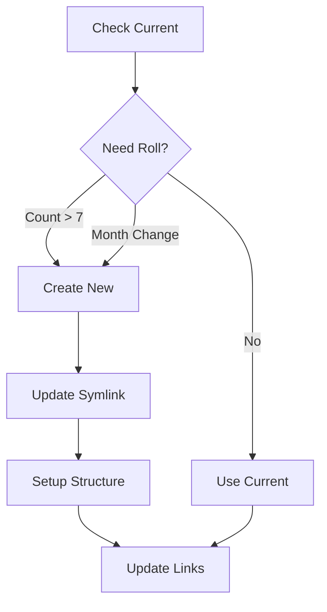

# Seasonal Folder Management

## Overview
Smart management of seasonal folders for mini-projects with auto-rolling and naming.

## Core Features
1. Folder Structure
   ```bash
   ~/work/projects/seasonal/
   ├── 2024_01_winter/  # current
   ├── 2023_12_dec/     # previous month
   ├── 2023_04_spring/  # previous quarter
   └── latest -> 2024_01_winter/  # symlink
   ```

2. Auto-rolling Rules
   - Count mini-projects in current folder
   - If count > threshold (default: 7)
     - Create new seasonal folder
     - Update 'latest' symlink
   - Or if time threshold reached (next month/quarter)

3. Naming Convention
   ```python
   class SeasonalFolder:
       patterns = {
           'monthly': 'season_{num}_Month_Year',  # season_42_nov_2024
           'quarterly': 'season_{num}_Season_Year'  # season_43_winter_2024
       }
       # e.g. 2024_01_winter, 2024_03_march
   ```

3. Folder Structure Examples
   ```bash
   ~/work/projects/seasonal/
   ├── season_42_nov_2024/        # early november
   ├── season_43_nov_2024/        # late november
   ├── season_44_nov-dec_2024/    # cross-month
   ├── season_45_winter_2024/     # quarterly
   └── latest -> season_45_winter_2024/
   ```

4. Content Organization
   ```bash
   season_45_winter_2024/
   ├── quick_script/              # mini project
   ├── data_analysis/            # mini project
   ├── auth -> ~/work/projects/main/features/auth/  # feature link
   ├── api_v2 -> ~/work/projects/api/features/v2/   # feature link
   ├── main_todo.md -> ~/work/projects/main/dev/todo_2024_03.md  # todo link
   ├── api_todo.md -> ~/work/projects/api/dev/todo_2024_03.md    # todo link
   └── .season_meta.json         # metadata for the season
   ```

5. Integration Points
   - Project Inspector: regular content analysis
   - Feature Management: auto-linking new features
   - Todo Collection: gathering related todos
   - Mini-project Creation: proper placement

## Flow Diagram Updated


# Raw
- seasonal folder -> this is the main feature. 
two key things
- count number of mini-projects in a seasonal folder
if more than n (5? 10?) -> roll over to a new season. Update 'latest' soflink
- rename seasonal folder based on how long it exists.
season_{num}_{season_name}
season name is either Month Yr (nov 2024)
or Quarter Yr (winter 2024)

we also should link this to other project where this will be used
- regular job that inspects that folder. fill it with some links / content?
- actually, let's softlink there all the other things as well - all featuers and miniprojects.
And todos maybe (in a subfolder)
so that seasons are a little more fleshy
- something else?
