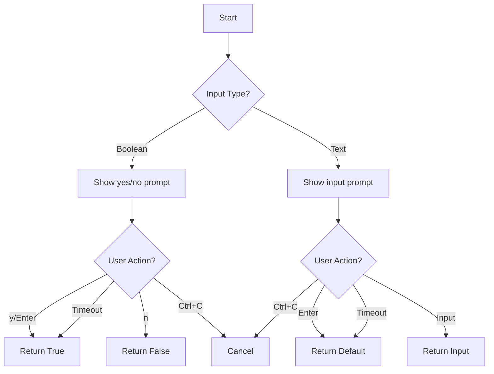

# Timed Confirmation Defaults

## Overview
Interactive prompts with generous timeouts and smart defaults.

## Core Features
1. Boolean Confirmations
   ```bash
   Using project: my-project (auto-yes in 15s)...
   ```
   - y/Enter -> immediate yes
   - n -> immediate no
   - timeout -> yes
   - Ctrl+C -> cancel

2. Input with Defaults
   ```bash
   Enter project name (default='my-proj' in 15s)...
   ```
   - Enter -> immediate default
   - Any text -> use as input
   - timeout -> use default
   - Ctrl+C -> cancel

## Configuration
```python
TIMEOUT_DEFAULT = 15  # seconds
TIMEOUT_EXTENDED = 30  # for complex decisions
```

## Flow Diagram


# Raw
no, also for queries with non-bool result too.
so if "tell me project name (default=..)" no response or enter - proceed. 
timeouts should be generous for me to think
